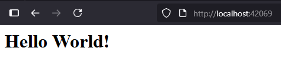

# HTTP/1.1 built on top of TCP

## Introduction
This is a fully functional **HTTP server built on top of TCP**. The server is TCP listener that has:
1) A parser that reads the incoming request in chunks, then goes on to extract and validate data such as **method, request target, protocol and version, headers and body** before storing this data in a struct.
2) A writer that utilises the extracted data to determine which handler to use before writing the appropriate response. This implementation is able to write the **status line, headers, body (chunked or unchunked) and trailers**.
3) Testing for the parser was done through a chunk reader that **simulates a network connection**. It passes the request to the parser packet by packet.

## Installation
To be able to try out the server locally, you would need [Go](https://go.dev/doc/install) installed. The current implementation utilises **v1.25.0**.

Once you have Go installed, clone the repo into your working directory using:
```
git clone https://github.com/junwei890/http-1.1.git
```

To run the server:
```
cd http-1.1
go run ./cmd/httpserver
```

## Usage
I've only written 3 endpoints for the server, them being `/`, `/httpbin/{}` and `/image`.

### / endpoint
This endpoint was written to test out my parser and writer with a basic GET request on a real network connection.

**With the server running**, in your preferred browser, head to [http://localhost:42069/](http://localhost:42069/), you should see this:


If you would like to see the response in the terminal instead, **with the server running**, run the following in a separate terminal:
```
curl -v http://localhost/42069
```

### /httpbin/{} endpoint
This endpoint acts as a proxy to [httpbin.org](https://httpbin.org/) and was written to test out my server's ability to respond with a chunked encoded body and trailers.

To be able to use this endpoint, **with the server running**, run the following in a separate terminal:
```
echo -e "GET /httpbin/stream/100 HTTP/1.1\r\nHost: localhost:42069\r\nConnection: close\r\n\r\n" | nc localhost 42069
```

You should see each individual chunk with the length of chunk in bytes in **hexadecimal format**, followed by the actual data itself. At the end of the response, you should also be able to see the trailers `X-Content-SHA256`, the **checksum of the chunked body** and `X-Content-Length`, the **length of the entire chunked body in bytes**.

### /image
This endpoint was written to test out my server's ability to respond with binary data.

**With the server running**, in your preferred browser, head to [http://localhost:42069/image](http://localhost:42069/image), you should see an image in the browser.

## Project walkthrough
### CRLF
`CRLF` stands for **Carriage Return Line Feed** and it is represented by `\r\n`. In HTTP requests and responses, `\r\n` appears at the end of every line, at the end of headers to signify the start of the body and at the end of the **chunked body** (a normal body isn't terminated with CRLF) or trailers depending on whether trailers are present.

### Request line parsing
A request line has **3** parts, the request `method`, the `request-target` and the `HTTP-version`. They follow this format, where `SP` represents a single whitespace:
```
method SP request-target SP HTTP-version CRLF
```

The following were considered when parsing the request line:
- The request line can only have **3** parts, no more, no less.
- Only the more common request methods are supported, see the [source code](./internal/request/request.go) for supported request methods.
- The request target must be prefixed with a `/`.
- Only `HTTP/1.1` is supported.

If any of the above weren't satisfied, the server would respond with a `400 Bad Request`.

### Header parsing
Headers are used to specify information regarding the request, such as `Content-Length` and `Content-Type` of the body, `Transfer-Encoding` for whether the body is chunked encoded and `Host` for the sender's host etc.

Headers or less commonly referred to individually as a `field-line` has 2 parts, the `field-name` and `field-value`. They follow the following format, where `OWS` stands for Optional Whitespace:
```
field-name: OWS field-value OWS CRLF
```

Though not specified in the format, you can have whitespace **before** the `field-name`. However, what you can't have is whitespace between the `field-name` and `:`. It should also be noted that only certain characters are allowed in the `field-name`, see the [source code](./internal/headers/headers.go) for the regex pattern I used to validate characters in the `field-name`.

At the end of headers, there should also be a **blank line** with a terminating `CRLF` to signify the end of headers and start of body.

If the headers in the request aren't formatted properly, then the server would respond with a `400 Bad Request`.

### Body parsing
A body is completely optional, though in this server implementation, there are several nuances that should be gone through:
- If a `Content-Length` header is not specified, it is assumed that a body is not present and parsing is done.
- If a `Content-Length` header is specified but the specified length is **more** than the length of body received, then it is assumed that the request is incomplete and the parser will error.
- If a `Content-Length` header is specified but the specified length is **less** than the length of body received, then the parser will error.
- Specifying a `Content-Length` of 0 and not specifying a `Content-Length` for an empty body are both **totally valid**.
- It should also be noted that lines in the body **do not** need to be ended with a `CRLF` and the body **does not** need to be terminated with a `CRLF`.

In the event an error is encountered while parsing the body, the server will respond with a `400 Bad Request`.

### Writing status lines
Once parsing of the request is done, it's finally time to write responses. A status line has **3** parts, the `HTTP-version`, the `status-code` and an optional `reason-phrase`. This is how it should look like:
```
HTTP-version SP status-code SP [ reason-phrase ] CRLF
```

Do note that if the `reason-phrase` is omitted, there still **needs** to be a whitespace between the `status-code` and `CRLF`. For the current server implementation, only the more common status codes I use have `reason-phrases` in the status line, see the [source code](./internal/response/response.go) to see all status codes that the server supports.

### Writing headers
Headers in responses are similar to headers in requests, they follow the same format. However, there are nuances that will be covered below in the [Chunked encoding](#chunked-encoding) section.

### Writing body
Writing the body to a response is very simple and the format follows the body from a request. There are only differences when writing a body that is **Chunked Encoded**.

### Chunked encoding
Chunked encoding is used when the size of the body is **large** or when the size of data is **not known** ahead of time.

Let's say the server has a large video file that it needs to send over to the client, it **wouldn't be feasible** to load the entire video into a buffer and send it all at once. Instead, the video should be **broken up into manageable chunks** which we can send chunk by chunk over the wire until it reaches the end of the video file. This way, the user wouldn't need to wait for the **entire video to be downloaded** before receiving it, they would instead be **receiving chunks of the video** as they are processed, increasing perceived performance.

Sometimes, the server may also **not know the size of the data** it is responding with, maybe our server acts as a **proxy** for another server (as in the case of this implementation) which does not include the `Content-Length` in it's response headers. Then chunked encoding is used to stream data to the client as it is being received by the server.

To carry out chunked encoding, the `Content-Length` header has to be replaced with the `Transfer-Encoding` header, with the `field-value` set to `chunked`. Then for the actual chunked encoded body, it should consist of **2** parts, the length of chunk in bytes in **hexadecimal format** and the actual data of the chunk itself. Something like this:
```
HTTP/1.1 200 OK\r\n
Content-Type: text/plain\r\n
Transfer-Encoding: chunked\r\n
\r\n
<length>\r\n
<data>\r\n
<length>\r\n
<data>\r\n
0\r\n
\r\n
```

In the event that there are **no trailers** after the chunked body as in the example above, then you would have a length of `0\r\n` followed by a terminating `\r\n`. This signals to the client that all chunks have been received.

### Writing trailers
Trailers are optional and can be used to check for data integrity of chunked encoding (as in the case of this implementation). To use trailers, there is a need to specify trailers in the headers beforehand. It can be done like so:
```
Trailer: X-Content-SHA256, X-Content-Length\r\n
```

In the case of this server, the **hash** of the chunked body and the **total length** of the chunked body in bytes are computed as it's being received from [httpbin.org](https://httpbin.org/). Once all data has been received, the server then writes the trailers after the `0\r\n` at the end of the chunked body, making sure to have a `CRLF` after each trailer. It then terminates the entire response with another `CRLF`.

## Final thoughts
This project was a great help in getting me intimately familiar with the HTTP/1.1 protocol, from edge cases in parsing requests to nuances in writing responses. Writing the request parser also helped solidify my problem solving skills.

Though it must be said that I have no intentions of extending this project further as I am happy with how it turned out. If I ever were to implement HTTP/2 or HTTP/3, it would be in a separate repo.
